"# TP15_java" 
# TP15_java
echo "# TP15_java" >> README.md

# 🧠 TP15 - Expressions Lambda en Java

Ce projet contient les exercices du **TP15 sur les expressions lambda en Java**, réalisés avec Eclipse et Java SE 21.

---

## 📸 Captures d’écran

Voici les résultats d’exécution des différents exercices :

### LambdaCalculateur.java
- L’exécution :
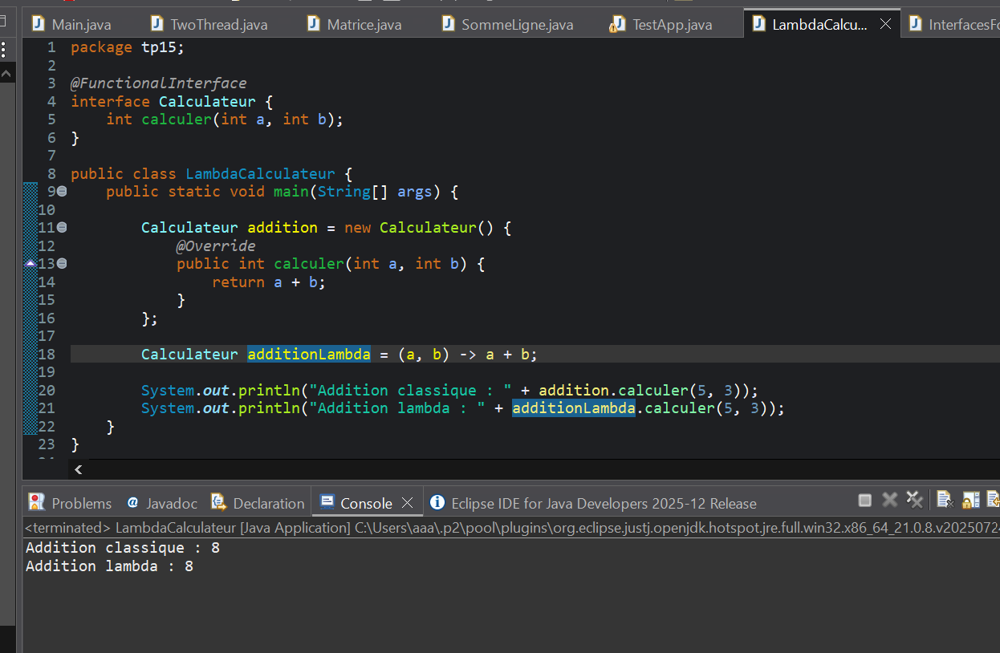

### InterfacesFonctionnelles
- L’exécution  :
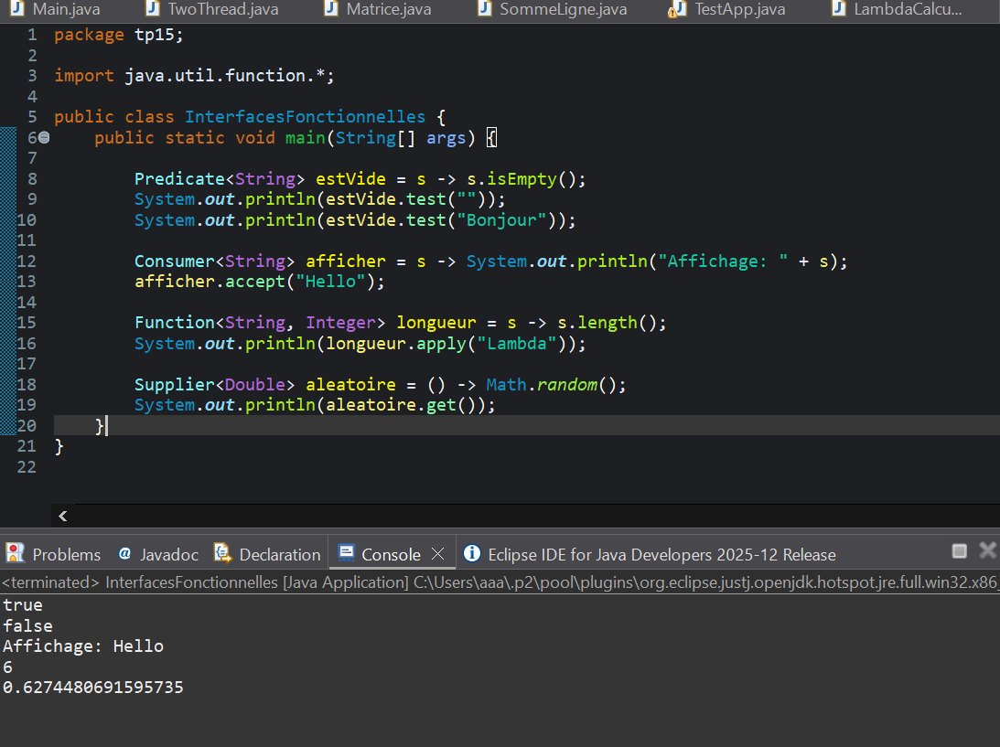

### InterfacesPrimitives.java
- L’exécution  :
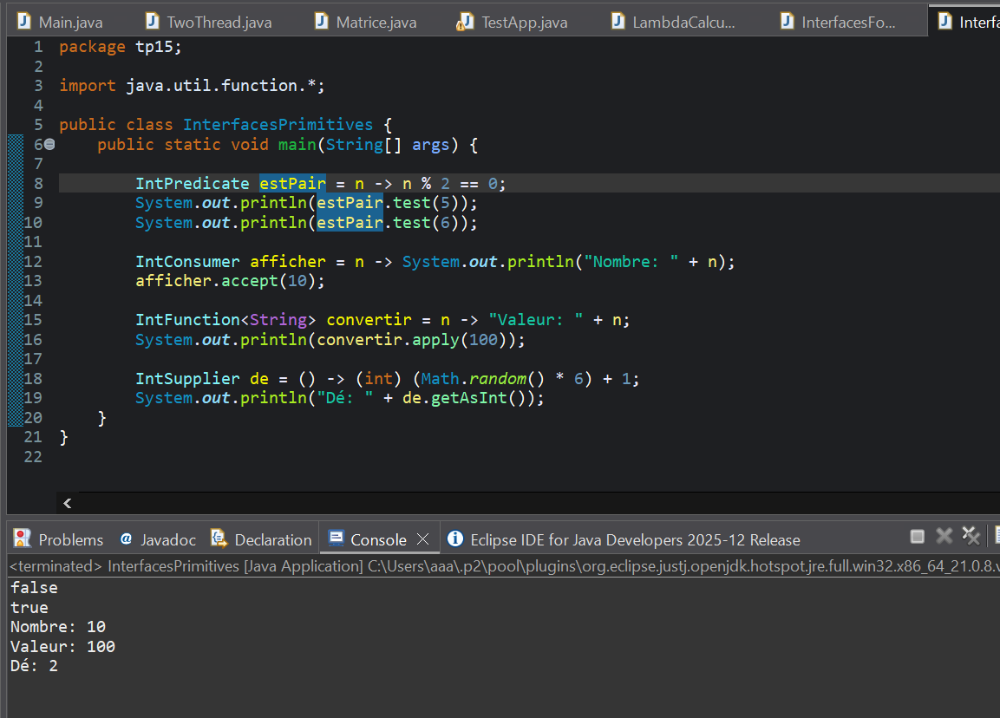

### SyntaxeLambda.java
- L’exécution :
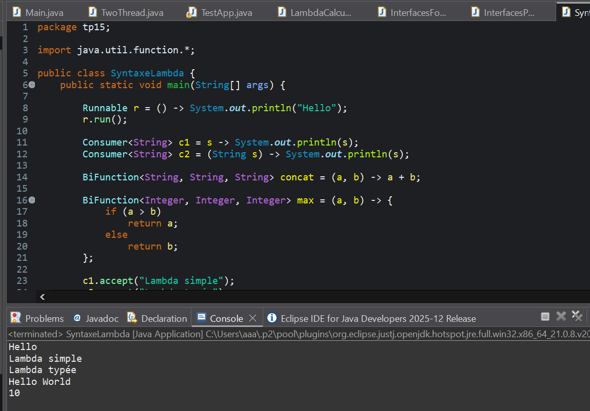

### CaptureLambda.java
- L’exécution  :
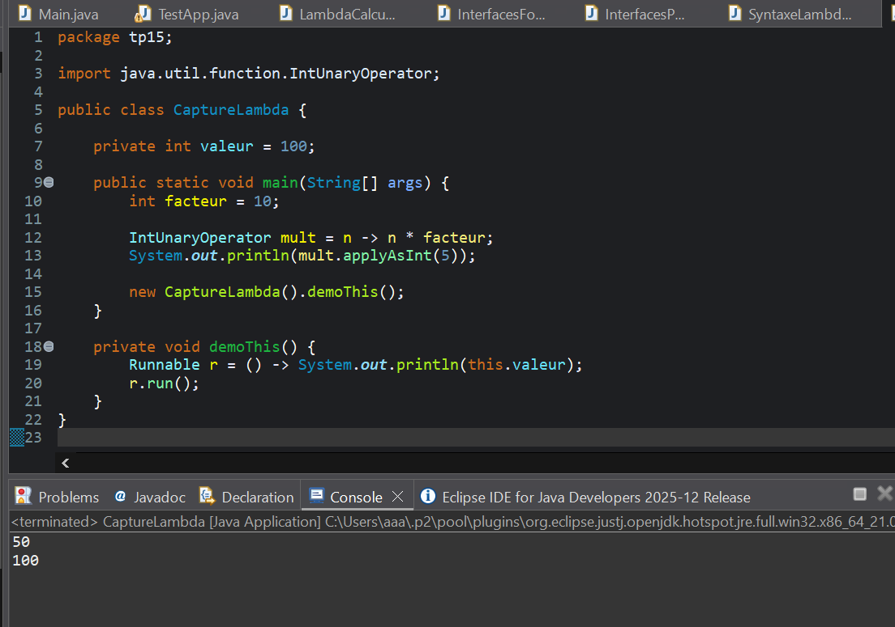

### ReferencesMethodes.java
- L’exécution  :
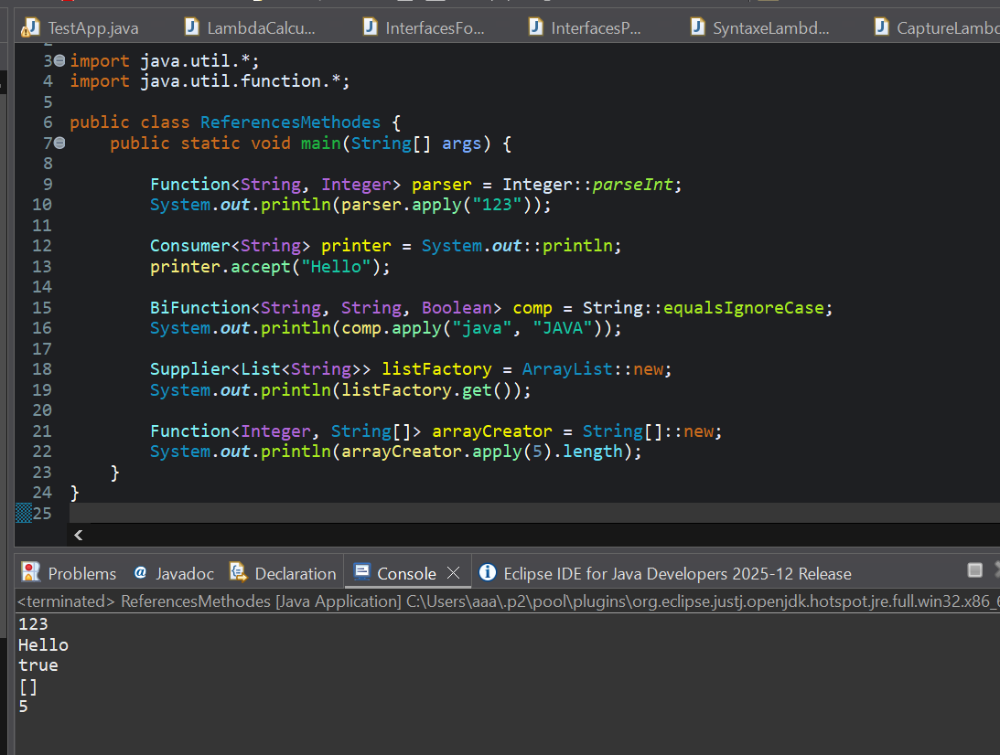

### StreamBasics.java
- L’exécution :
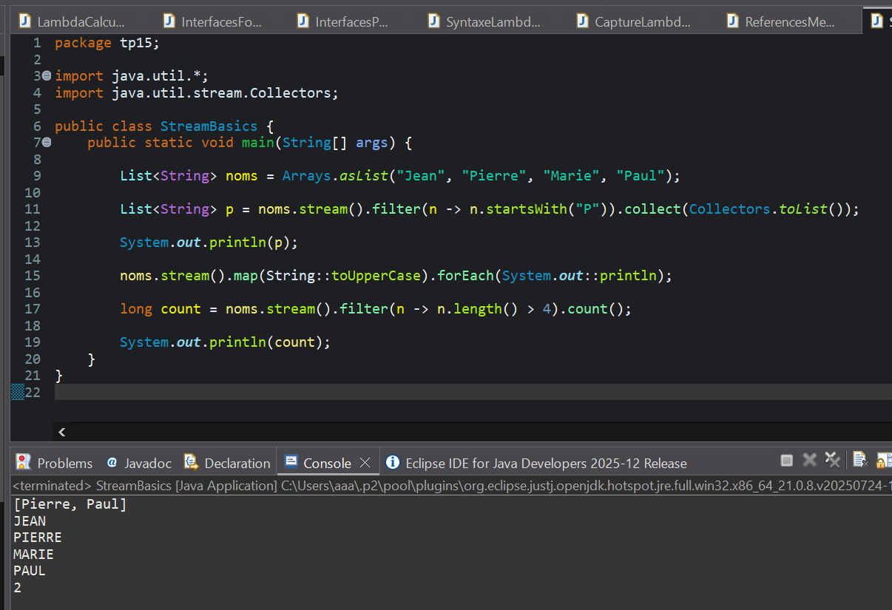

### StreamAvance.java
- L’exécution  :
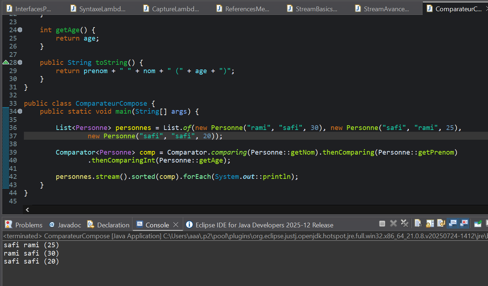

### CompositionFonctions.java
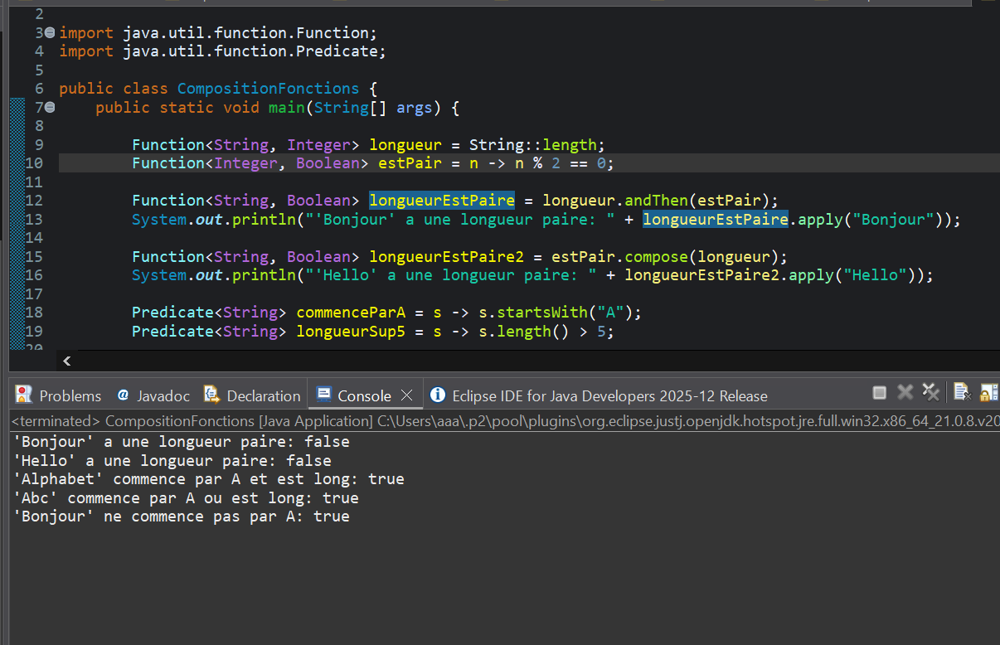

### ExceptionsLambda.java
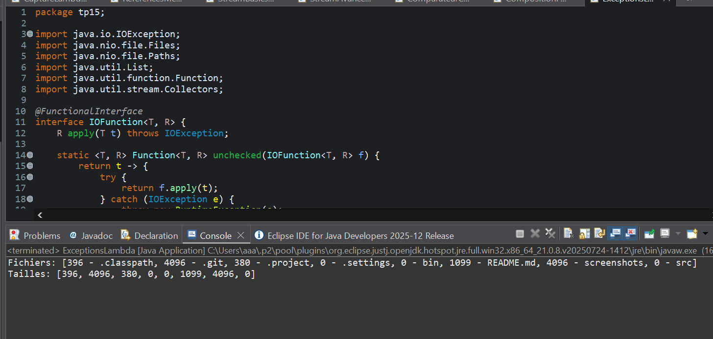

### ValidationFormulaire.java

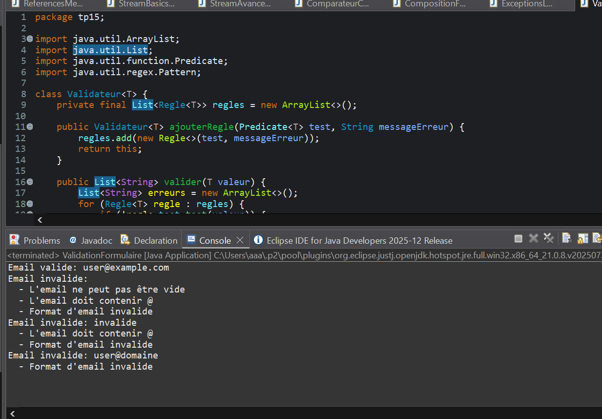

### TriFunctionDemo.java

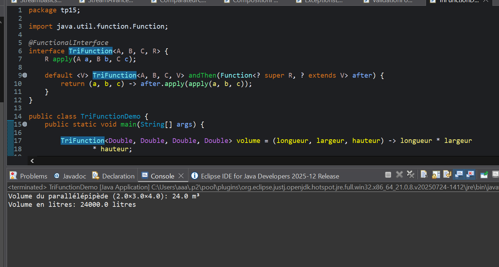

### CompteurTODO.java

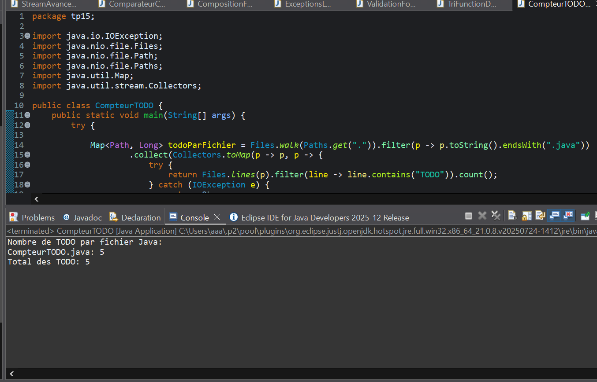

### FactorielleStream.java

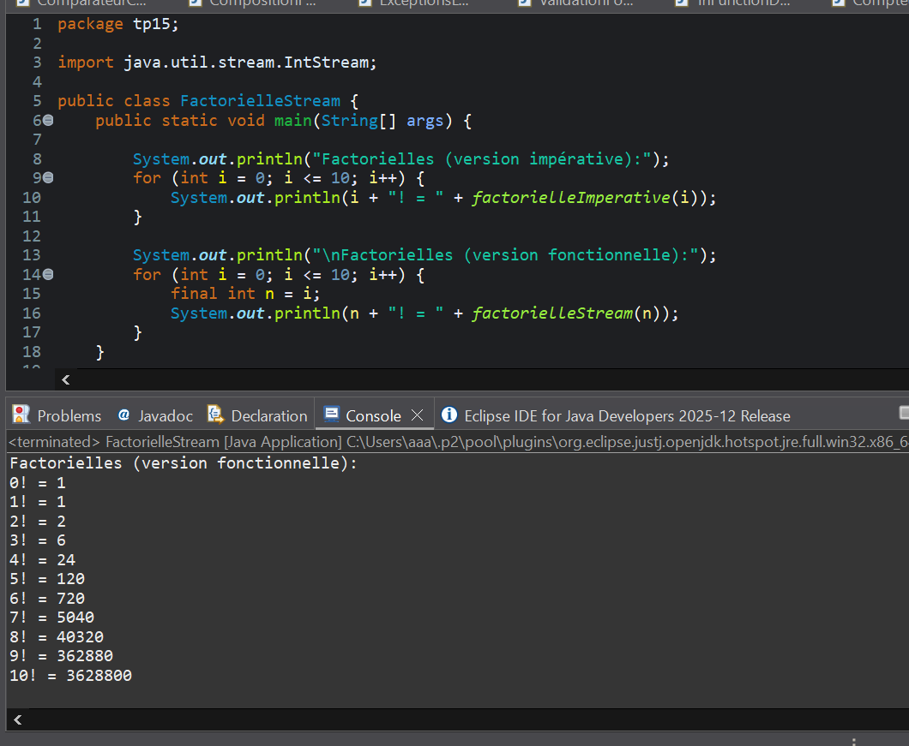

---

## 👤 Auteur
 NOUHAYLA SABIQ
